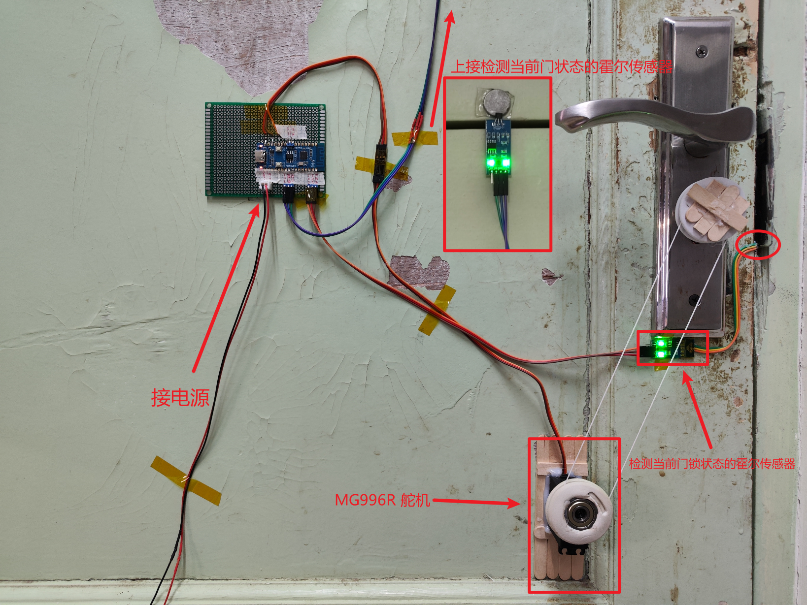

# ESP32-door-controller
基于 ESP32-C3 和 MicroPython 实现的宿舍门锁控制

~~*本项目包含多种脑溢血操作，请谨慎阅览*~~

## 实现的功能

- [x] 断网后自动重连
- [x] 与服务器的 mqtt 通信
- [x] 基于异步实现的多任务，使用装饰器保持代码简洁
- [x] 获取小米温湿度计蓝牙广播的温度信息
- [ ] 通过 mqtt 实现与 qq 机器人连接，参见 [Orilx/Niko-py](https://github.com/Orilx/Niko-py)

## 装置组成

- 合宙 ESP32-C3 开发板
- 两个 3144霍尔开关传感器模块，一个用来检测当前门锁状态，另一个用来监测门的开关情况
- MG996R 360° 舵机，充当减速电机拉动门锁

## 连接示例
  

## 关于获取小米温湿度计的数据

1. 首先要为小米温湿度计刷入 [第三方固件](https://pvvx.github.io/ATC_MiThermometer/TelinkMiFlasher.html) 并开启蓝牙广播功能，具体可以参考 [这篇博客](https://roov.org/2021/06/mitemperature2/)

2. 然后在 `config.py` 文件中填入您的小米温湿度计的 MAC 地址
